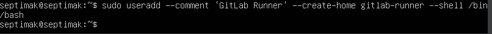

# Basic CI/CD

### Part 1. Настройка **gitlab-runner**

**== Задание ==**

##### Подними виртуальную машину *Ubuntu Server 22.04 LTS*.

##### Скачай и установи на виртуальную машину **gitlab-runner**.

##### Запусти **gitlab-runner** и зарегистрируй его для использования в текущем проекте (*DO6_CICD*).

**== Выполнение  ==**

##### Поднимаю виртуальную машину *Ubuntu Server 22.04 LTS*.

##### Скачиваю и устанавливаю на виртуальную машину **gitlab-runner**.

`Загрузить бинарный файл`

`Дать файлу разрешение на исполнение:`

`Создать пользователя GitLab CI`

`Установить как службу`

`Запустить службу`

#### Регистрируюсь в Gitlab

#### `sudo gitlab-runner register`

`Cвой URL-адрес GitLab`

`Cвой регистрационный токен`

`Название раннера`

`Теги для заданий, разделенные запятыми`

`Тип исполнителя`

### Part 2. Сборка

**== Задание ==**

#### Напиши этап для **CI** по сборке приложений из проекта *C2_SimpleBashUtils*.

##### В файле _gitlab-ci.yml_ добавь этап запуска сборки через мейк файл из проекта _C2_.

##### Файлы, полученные после сборки (артефакты), сохрани в произвольную директорию со сроком хранения 30 дней.

**== Выполнение  ==**

#### Пишу этап для **CI** по сборке приложений из проекта *C2_SimpleBashUtils*.

`stages - последовательность этапов выполнения.`

`build - название задачи для этапа сборки.`

`stage: build - указывает, что эта задача относится к этапу build.`

`script - содержит команды, которые GitLab Runner будет выполнять`

`artifacts - определяет, какие файлы будут сохранены после выполнения этой задачи.`

`expire_in - устанавливает скрок хранения артефактов.`

#### Неподготовленная оболочка
`При пуше мы столкнемся со следующей ошибкой`

`Cреда не подготовлена к запуску. Дефолтная конфигурация gitlab-runner, производящая очистку терминала при выходе из оболочки shell. Что бы исправить - комментим строчки в .bash_logout`

#### Закоментим строчки в .bash_logout

`Сначала пишем sudo visudo и в файле кфг дописываем в конце gitlab-runner ALL=(ALL) NOPASSWD: ALL`

#### Это требуется для того, что бы не запрашивало пароль, при скачке доп пакетов

`Затем вылезет ошибка что нет make и мы вписываем эту команду в yml`

`Затем покажет что нет уже gcc  и мы докачиваем и его`

`После установки make и gcc, pipeline проходит`

## Part 3. Тест кодстайла

**== Задание ==**

#### Напиши этап для **CI**, который запускает скрипт кодстайла (*clang-format*).

##### Если кодстайл не прошел, то «зафейли» пайплайн.

##### В пайплайне отобрази вывод утилиты *clang-format*.

**== Выполнение ==**

#### Пишу этап для **CI**, который запускает скрипт кодстайла (*clang-format*) но обязательно дописываю - chmod +x .clang-format что бы дать кленгу права работать.

#### Сначала добаим пробелы в коде, что бы стайл завалился 

##### Затем исправим и увидим что кодстайл прошел, поэотому пайплайн фейлить не надо.

### Part 4. Интеграционные тесты

**== Задание ==**

#### Напиши этап для **CI**, который запускает твои интеграционные тесты из того же проекта.

##### Запусти этот этап автоматически только при условии, если сборка и тест кодстайла прошли успешно.

##### Если тесты не прошли, то «зафейли» пайплайн.

##### В пайплайне отобрази вывод, что интеграционные тесты успешно прошли / провалились.

**== Выполнение ==**

#### Написал этап для **CI**, который запускает мои интеграционные тесты из того же проекта.

##### Запускаю этот этап автоматически только при условии, если сборка и тест кодстайла прошли успешно.

##### В пайплайне отобразился вывод, что интеграционные тесты успешно прошли ;3

### Part 5. Этап деплоя

**== Задание ==**

##### Подними вторую виртуальную машину *Ubuntu Server 22.04 LTS*.

#### Напиши этап для **CD**, который «разворачивает» проект на другой виртуальной машине.

##### Запусти этот этап вручную при условии, что все предыдущие этапы прошли успешно.

##### Напиши bash-скрипт, который при помощи **ssh** и **scp** копирует файлы, полученные после сборки (артефакты), в директорию */usr/local/bin* второй виртуальной машины.

##### В файле _gitlab-ci.yml_ добавь этап запуска написанного скрипта.

##### В случае ошибки «зафейли» пайплайн.

##### Сохрани дампы образов виртуальных машин.

**== Выполнение ==**

##### Поднял вторую виртуальную машину *Ubuntu Server 22.04 LTS*.

#### Сделаем статическую маршрутизацию между машинами

`sudo netplan apply`

#### Пинганем для проверки с первой - вторую машину и наоборот

#### Написал этап для **CD**, который «разворачивает» проект на другой виртуальной машине.

#### Заработало

### Part 6. Дополнительно. Уведомления

`-` Здесь написано, что твое следующее задание выполняется специально для нобелевских лауреатов. Здесь не сказано, за что они получили премию, но точно не за умение работать с **gitlab-runner**.

**== Задание ==**

##### Настрой уведомления о успешном/неуспешном выполнении пайплайна через бота с именем «[твой nickname] DO6 CI/CD» в *Telegram*.

**== Выполнение ==**

#### Добавляем стадию в yml файл, а так же после каждой стадии добавляем after script что бы нам отправлялся статус каждого этапа

#### Пишем баш скрипт для тг бота 

#### Активируем бота и задаем ему имя и теги

#### Пушим и проверяем бота

