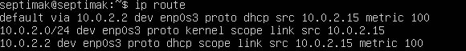
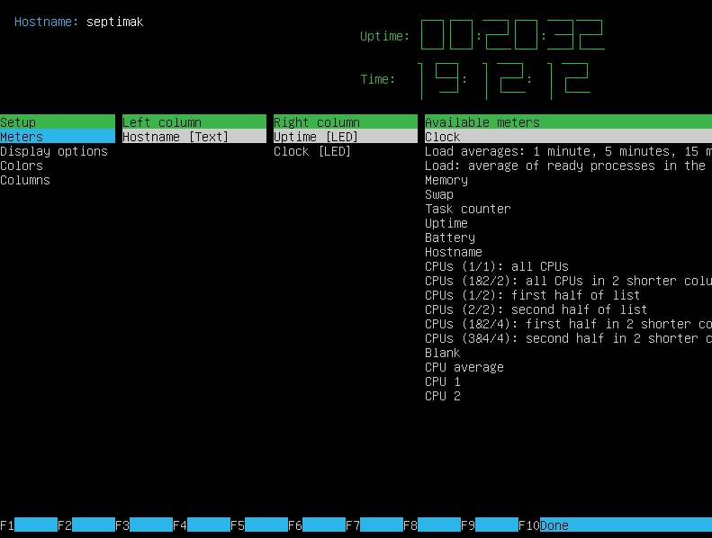
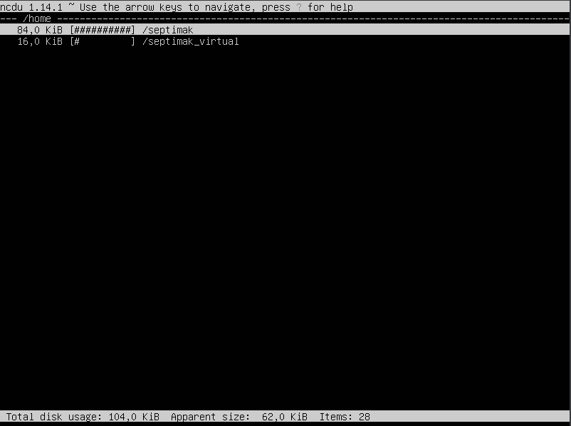
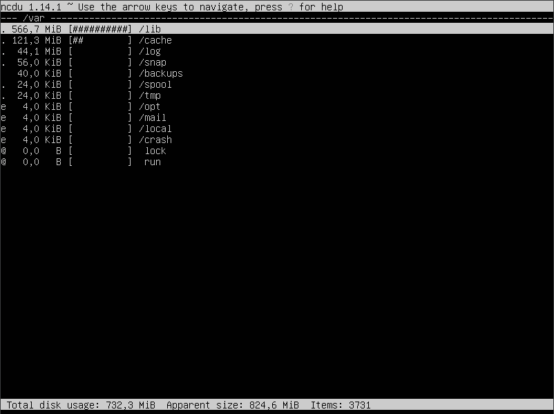
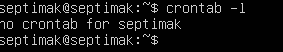

# Report Linux DO1
## Part 1. Установка ОС
1. Дистрибутив Ubuntu Server
ubuntu-20.04-live-server-amd64.iso
скачиваем с сайта: 
https://www.ubuntu.com/download/server 
Устанавливаем в виртуальную машину VirtualBox. 
Чтобы узнать версию ОС, необходимо выполнить команду: 
`cat /etc/issue` 
 

## Part 2. Создание пользователя
1. Для создания нового пользователя небходимо выполнить команду: 
`sudo useradd -G adm septimak_virtual` 
 
2. Проверяем нового созданного пользователя: 
`cat /etc/passwd | grep septimak_virtual` 
 
3. Проверяем к каким группам относится новый пользователь: 
`groups septimak_virtual` 
 

## Part 3. Настройка сети ОС
1. Задаем и проверяем новое имя машины: 
`sudo hostname user-1` 
 
2. Задаем новую временную зону и проверяем изменения: 
`sudo timedatectl set-timezone Asia/Novosibirsk` 
`timedatectl` 
 
3. Установили набор сетевых инструментов 
 
Вывели информацию о сетевых интерфейсах 
 
`lo (loopback device) – виртуальный интерфейс, присутствующий по умолчанию в любом Linux. Он используется для отладки сетевых программ и запуска серверных приложений на локальной машине. С этим интерфейсом всегда связан адрес 127.0.0.1. У него есть dns-имя – localhost.` 
4. Получили ip от dhcp сервера 
`10.0.2.15`

       

**DHCP - Dynamic Host Configuration Protocol** 
    `DHCP — сетевой протокол, позволяющий сетевым устройствам автоматически получать IP-адрес и другие параметры, необходимые для работы в сети TCP/IP.` 
  5. Узнали внешний IP-адрес 
        
     6. Узнали внутренний IP-адрес шлюза, он же ip-адрес по умолчанию 
     
7. Изменили файл /etc/netplan/*.yaml, применили изменения в netplan, перезагрузились 
 
 
`Пишем sudo netplan apply a затем - `

 

8. Проверяем, что адреса соотсветствуют заданным в предыдущем пункте 
 
9. Успешно пропинговали удаленные хосты  ya.ru 
 
 

## Part 4. Обновление ОС
1. Обновляем системные пакеты: 
`sudo apt update` 
 
`sudo apt upgrade` 
 
 

## Part 5. Использование команды sudo
* `Sudo — это утилита, предоставляющая привилегии root для выполнения административных операций в соответствии со своими настройками. Она позволяет легко контролировать доступ к важным приложениям в системе. По умолчанию, при установке Ubuntu первому пользователю (тому, который создаётся во время установки) предоставляются полные права на использование sudo. Т.е. фактически первый пользователь обладает той же свободой действий, что и root.` 

1. Выдаем права sudo для пользователя: 
`sudo usermod -aG sudo septimak_virtual` 
 
2. Для того, чтобы изменить hostname ОС от имени пользователя необходимо выполнить следующие команды: 
Проверяем измененный hostname: 
`su - septimak_virtual` 
 
`sudo hostname user-2` 
`hostname` 
 

## Part 6. Установка и настройка службы времени
1. Настраиваем автоматическую синхронизацию времени: 
`sudo apt install ntpdate` 
 
`sudo apt install systemd-timesyncd` 
 
`timedatectl show` 
 

 
## Part 7. Установка и использование текстовых редакторов
1. Установить текстовые редакторы VIM (+ любые два по желанию NANO, MCEDIT, JOE и т.д.)   
sudo apt install vim     
sudo apt install nano     
sudo apt install mcedit 
2. Используя каждый из трех выбранных редакторов, создайте файл test_X.txt, где X -- название редактора, в котором создан файл. Напишите в нём свой никнейм, закройте файл с сохранением изменений.
3. Используя каждый из трех выбранных редакторов, откройте файл на редактирование, отредактируйте файл, заменив никнейм на строку "21 School 21", закройте файл без сохранения изменений.
4. Используя каждый из трех выбранных редакторов, отредактируйте файл ещё раз (по аналогии с предыдущим пунктом), а затем освойте функции поиска по содержимому файла (слово) и замены слова на любое другое.
### VIM
1. 
2. 
3. 
4. 
* vim test_vim.txt   
* Режим редактирования: i
* Выйти из режима редактирования: esc   
* Выход с охранением: :wq     
* Выход без сохранения: :q        
* Поиск: /<текст, который хотим найти>    
* Замена: :s/<что хотим изменить>/<на что хотим заменить>
### JOE
1. 
2. 
3. 
4. 
* joe test_joe.txt       
* Выход с охранением: Ctrl + K X
* Выход без сохранения: Ctrl + C      
* Поиск: Ctrl + K F
* Замена: Ctrl + T
### NANO
1.    
2.     
3.
4.
* nano test_nano.txt       
* Выход с охранением: CTRL + x, затем y, и  enter
* Выход без сохранения: CTRL + x, затем n       
* Поиск: CTRL + W, затем enter (alt + w для перехода к след. вхождению, ctrl + c  для преращения поиска)
* Замена: CTRL + \\ <что хотим изменить + enter> + <на что хотим заменить + enter> + A(для замены все вхождения) или y и n по отдельности

## Part 8. Установка и базовая настройка сервиса SSHD
1. Устанавливаем sshd, добавляем автостарт и запускаем: 
`sudo apt update` 

`sudo apt-get install ssh` 
 
`sudo apt install openssh-server` 
 
Если служба не активна, запустите ее вручную с помощью команды: 
`sudo systemctl enable ssh` 
 
`sudo systemctl start sshd` 
`systemctl status sshd` 
 
Если в системе включен брандмауэр, обязательно откройте порт SSH:    
`sudo ufw allow ssh`

2. Перенастраиваем службу sshd на порт 2022: 
`sudo nano /etc/ssh/sshd_config` 
 
`systemctl restart sshd` 
`reboot` 

 
 

3. Используя команду ps, показать наличие процесса sshd: 
`Команда ps выдает информацию об активных процессах.` 
`-A, -e, (a) - выбрать все процессы` 
`-a - выбрать все процессы, кроме фоновых` 
`-d, (g) - выбрать все процессы, даже фоновые, кроме процессов сессий` 
`-N - выбрать все процессы кроме указанных` 
`-С - выбирать процессы по имени команды` 
`-G - выбрать процессы по ID группы` 
`-p, (p) - выбрать процессы PID` 
`-x заставляет ps отображать список всех процессов, которыми вы владеете` 
`-ppid - выбрать процессы по PID родительского процесса` 
`-s - выбрать процессы по ID сессии` 
`-t, (t) - выбрать процессы по tty` 
`-u, (U) - выбрать процессы пользователя` 
`r - просмотреть все работающие (running) процессы` 

4. Вывод команды netstat -tan: 
 
* `Ключ -t отображает только TCP сокеты` 
* `Ключ -a отображает все сокеты (listening and non-listening)` 
* `Ключ -n отображает адреса и порты вместо имен` 
* `Proto показывает протокол, используемый сокетов` 
* `Recv-Q - количество байтов в очереди приема (ожидающих чтения) для сокета` 
* `Send-Q - количество байтов в очереди отправки (ожидающих отправки) для сокета` 
* `Local Address - локальный IP-адрес участвующий в соединении или связанный со службой, ожидающей входящие соединения` 
* `Foreign Address - внешний IP-адрес, участвующий в создании соединения` 
* `State - состояние сокета (LISTEN означает, что сокет находится в состоянии прослушивания и ожидает входящих соединений)` 
* `Если в качестве адреса отображается 0.0.0.0 , то это означает - "любой адрес", т.е в соединении могут использоваться все IP-адреса существующие на данном компьютере.` 

## Part 9. Установка и использование утилит top, htop
1. Выполняем команду: 
`sudo top` 
 
 
`uptime: 7min` 
`количество авторизованных пользователей: 1 user` 
`общая загрузка системы: 0,00, 0,02, 0,00 (загрузка системы за последние 1, 5 и 15 минут)` 
`общее количество процессов: Tasks: 105 total, 1 running, 104 sleeping, 0 stopped, 0 zombie` 
`загрузка cpu: 0,2 us, 0,0 sy, 0,0 ni,99,8 id, 0,0 wa, 0,0 hi, 0,0 si, 0,0 st` 
`PID процесса занимающего больше всего памяти - 1 (top -o %MEM);` 
`PID процесса, занимающего больше всего процессорного времени - 1111 (top -o %CPU);` 

2. Выполняем команду: 
`sudo htop` 
 
2.1. Сортировка htop по PID: 
 
2.2. Сортировка htop по PERCENT_CPU: 
 
2.3. Сортировка htop по PERCENT_MEM: 
 
2.4. Сортировка htop по TIME: 
 
2.5. Фильтр для процесса sshd: 
 
2.6. Фильтр для процесса syslog: 
 
2.7. С добавленным выводом hostname, clock и uptime 
 
## Part 10. Использование утилиты fdisk
1. Выполняем команду: 
`sudo fdisk -l` 
 
`Название жесткого диска: Disk model: VBOX HARDDISK` 
 
`Размер жесткого диска: 25 GiB` 
 
`Количество секторов: 52428800 sectors` 
2. Выполняем команду: 
`sudo free -h` 
`Флаг -h выводит информацию в гигабайтах` 
 
`Размер swap:  2.2 GiB` 
## Part 11. Использование утилиты df
1. Узнаем информацию о дисковом пространстве: 
`sudo df / df` 
 
`Размер раздела: 11758760` 
`Размер занятого пространства: 5031092` 
`Размер свободного пространства: 6108560` 
`Процент использования: 46%` 
`Единица измерения: 1килобайт` 
2. Запустить команду df -Th 
`sudo df -Th` 
 
`Размер раздела: 12G` 
`Размер занятого пространства: 4,8G` 
`Размер свободного пространства: 5,9G` 
`Процент использования: 46%` 
`Тип файловой системы раздела: ext4` 
## Part 12. Использование утилиты du
1. Вывод размера папок /home, /var, /var/log 
`sudo du -s /home ` 
`sudo du -s /var ` 
`sudo du -s /var/log -` 
 
2. Вывод размера всего содержимого в /var/log: 
`sudo du -sh /var/log/* ` 
 

## Part 13. Установка и использование утилиты ncdu
1. Вывод размера папок /home, /var, /var/log с помощью утилиты ncdu: 
* устанавливаем утилиту ncdu: `sudo apt install ncdu` 
 
* выполняем команды: 
`sudo ncdu /home` 

 
`sudo ncdu /var` 

 
`sudo ncdu /var/log` 

 
## Part 14. Работа с системными журналами
1. Поиск последней успешной авторизации, имени пользователя и метода входа в систему: 
`cat /var/log/auth.log | grep 'session opened'` 
 
`Время авторизации - Jul 17 20:08:01` 
`Имя пользователя - septimak` 
`Метод входа в систему - sudo: pam_unix(sudo:session)` 
2. Перезапуск службы sshd: 
 
`vim /var/log/syslog | grep ssh` 
3. Поиск лога с сообщением о рестарте sshd: 
 

## Part 15. Использование планировщика заданий CRON
1. Используя планировщик заданий, запустить команду uptime через каждые 2 минуты: 
`crontab -e` 
 
2. Найти в системных журналах строчки (минимум две в заданном временном диапазоне) о выполнении: 
 
3. Вывести на экран список текущих заданий для CRON: 
`crontab -l` 
 
4. Удалить все задания из планировщика заданий: 
`crontab -r` 
 
5. Список текущих задач: 
`crontab -l` 
 