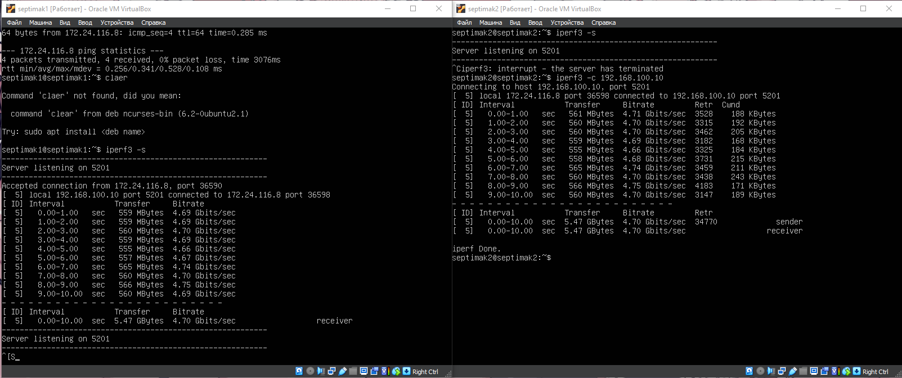
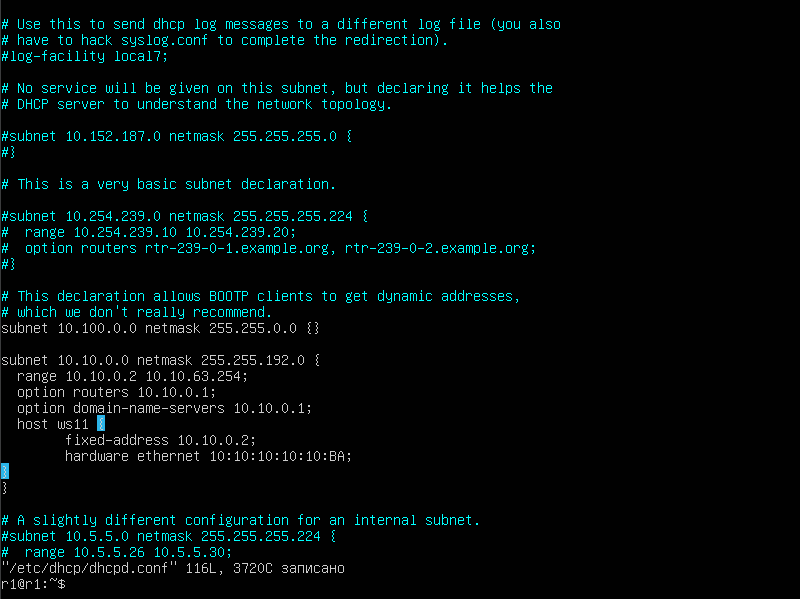
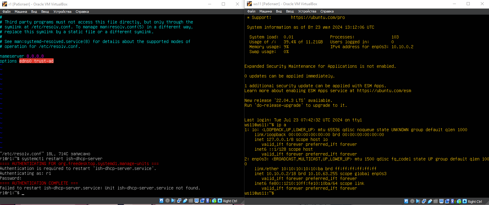

# Part 1. Инструмент **ipcalc**

**== Задание ==**

##### Подними виртуальную машину (далее -- ws1)

#### 1.1. Сети и маски
##### Определи и запиши в отчёт:
##### 1) Адрес сети *192.167.38.54/13*
##### 2) Перевод маски *255.255.255.0* в префиксную и двоичную запись, */15* в обычную и двоичную, *11111111.11111111.11111111.11110000* в обычную и префиксную
##### 3) Минимальный и максимальный хост в сети *12.167.38.4* при масках: */8*, *11111111.11111111.00000000.00000000*, *255.255.254.0* и */4*
**== Выполнение ==**

1.

1. 192.167.38.54/13 - prefix
2. 255.248.0.0 - defolt
3. 11111111.11111000.00000000.00000000 - dvoicnhaa

1. Для ip 12.167.38.4

#### 1.2. localhost
##### Определи и запиши в отчёт, можно ли обратиться к приложению, работающему на localhost, со следующими IP: *194.34.23.100*, *127.0.0.2*, *127.1.0.1*, *128.0.0.1*

 1. `Можно обратиться - 127.0.0.2, 127.1.0.1`
 2. `Нельзя обратиться - 194.34.23.100, 128.0.0.1`

 #### 1.3. Диапазоны и сегменты сетей
##### Определи и запиши в отчёт:
##### 1) Какие из перечисленных IP можно использовать в качестве публичного, а какие только в качестве частных: *10.0.0.45*, *134.43.0.2*, *192.168.4.2*, *172.20.250.4*, *172.0.2.1*, *192.172.0.1*, *172.68.0.2*, *172.16.255.255*, *10.10.10.10*, *192.169.168.1*
##### 2) Какие из перечисленных IP адресов шлюза возможны у сети *10.10.0.0/18*: *10.0.0.1*, *10.10.0.2*, *10.10.10.10*, *10.10.100.1*, *10.10.1.255*

1.  
`Публичные -  134.43.0.2, 192.172.0.1, 192.169.168.1, 172.0.2.1, 172.68.0.2`

`Частные - 10.0.0.45, 192.168.4.2, 172.20.250.4, 172.16.255.255, 10.10.10.10`

2.

`Возможен 10.10.0.2, 10.10.10.10`

`Невозможен 10.0.0.1, 10.10.0.2, 10.10.100.1, 10.10.1.255`

## Part 2. Статическая маршрутизация между двумя машинами

**== Задание ==**

##### Подними две виртуальные машины (далее -- ws1 и ws2).

##### С помощью команды `ip a` посмотри существующие сетевые интерфейсы.
- В отчёт помести скрин с вызовом и выводом использованной команды.
##### Опиши сетевой интерфейс, соответствующий внутренней сети, на обеих машинах и задать следующие адреса и маски: ws1 - *192.168.100.10*, маска */16*, ws2 - *172.24.116.8*, маска */12*.
- В отчёт помести скрины с содержанием изменённого файла *etc/netplan/00-installer-config.yaml* для каждой машины.
##### Выполни команду `netplan apply` для перезапуска сервиса сети.
- В отчёт помести скрин с вызовом и выводом использованной команды.

#### 2.1. Добавление статического маршрута вручную
##### Добавь статический маршрут от одной машины до другой и обратно при помощи команды вида `ip r add`.
##### Пропингуй соединение между машинами.
- В отчёт помести скрин с вызовом и выводом использованных команд.

#### 2.2. Добавление статического маршрута с сохранением
##### Перезапусти машины.
##### Добавь статический маршрут от одной машины до другой с помощью файла */etc/netplan/00-installer-config.yaml*.
- В отчёт помести скрин с содержанием изменённого файла */etc/netplan/00-installer-config.yaml*.
##### Пропингуй соединение между машинами.
- В отчёт помести скрин с вызовом и выводом использованной команды.

**== Выполнение ==**

`ip a`

Описал сетевой интерфейс, соответствующий внутренней сети, на обеих машинах и задал следующие адреса

2.1

Пишем 
`sudo ip r add "ip машины" dev enp0s3`

Затем пингуем машину к которой мы создали статический маршрут - 
`ping -c 4 "ip машины"`

2.2

Ребутаем машины `reboot`

Добавляем статический маршрут лот одной к другой машине, но уже с сохранением

Пинугем после изменения нетплана ---

## Part 3. Утилита iperf3

**== Задание ==**

*В данном задании используются виртуальные машины ws1 и ws2 из Части 2*

#### 3.1. Скорость соединения
##### Переведи и запиши в отчёт: 8 Mbps в MB/s, 100 MB/s в Kbps, 1 Gbps в Mbps.

#### 3.2. Утилита **iperf3**
##### Измерь скорость соединения между ws1 и ws2.
- В отчёт помести скрины с вызовом и выводом использованных команд.

**== Выполнение ==**

3.1

`8 Mbps = 1 MB/s`

`100 MB/s = 102400 Kbps`

`1 Gbps = 1024 Mbps`

3.2

Измерили соединение между машинами ---

## Part 4. Сетевой экран

**== Задание ==**

#### 4.1. Утилита **iptables**
##### Создай файл */etc/firewall.sh*, имитирующий фаерволл, на ws1 и ws2:
##### Нужно добавить в файл подряд следующие правила:
##### 1) На ws1 примени стратегию, когда в начале пишется запрещающее правило, а в конце пишется разрешающее правило (это касается пунктов 4 и 5).
##### 2) На ws2 примени стратегию, когда в начале пишется разрешающее правило, а в конце пишется запрещающее правило (это касается пунктов 4 и 5).
##### 3) Открой на машинах доступ для порта 22 (ssh) и порта 80 (http).
##### 4) Запрети *echo reply* (машина не должна «пинговаться», т.е. должна быть блокировка на OUTPUT).
##### 5) Разреши *echo reply* (машина должна «пинговаться»).
4.1
`Скриншоты с содержанием /etc/firewall.sh на обеих машинах`

`Запуск коммандой chmod +x /etc/firewall.sh и sudo /etc/firewall.sh`

#### 4.2. Утилита **nmap**
##### Командой **ping** найди машину, которая не «пингуется», после чего утилитой **nmap** покажи, что хост машины запущен.

`Пингуем машины `

`Пишем NMAP после пинга, на машине которая не пингуется`

## Part 5. Статическая маршрутизация сети

**== Задание ==**

##### Подними пять виртуальных машин (3 рабочие станции (ws11, ws21, ws22) и 2 роутера (r1, r2)).

#### 5.1. Настройка адресов машин
##### Настрой конфигурации машин в *etc/netplan/00-installer-config.yaml* согласно сети на рисунке.

#### 5.2. Включение переадресации IP-адресов
##### Для включения переадресации IP, выполни команду на роутерах:

#### 5.4. Добавление статических маршрутов
##### Добавь в роутеры r1 и r2 статические маршруты в файле конфигураций. Пример для r1 маршрута в сетку 10.20.0.0/26:

#### 5.5. Построение списка маршрутизаторов

#### 5.6. Использование протокола **ICMP** при маршрутизации
##### Запусти на r1 перехват сетевого трафика, проходящего через eth0 с помощью команды:

**== Выполнение ==**

`Подняли 5 машин`

5.1 `Изменили netplan всем машинам`

`Пишем ip -4 a`

`Пингуем машины ws21 и ws 22, а так же машины r1 и ws11`

5.2 `Включение переадресации IP-адресов`

выполняю команду на роутерах:
`sysctl -w net.ipv4.ip_forward=1`

Открываю файл /etc/sysctl.conf и добавляю в него следующую строку:

`net.ipv4.ip_forward = 1`

5.3

Настроил маршрут по-умолчанию (шлюз) для рабочих станций. Для этого добавил default перед IP роутера в файле конфигураций.

`Добавился маршрут в иаблицу маршрутизации`

`Пингую r2  с ws11 и смотрю дошел ли пинг`

5.4

`Добавил в роутеры r1 r2 стат. маршруты в файл конфигурации`

`Пишем ip r и вывожу таблицу с маршрутами`

Запускаю команды 
`ip r list 10.10.0.0/18 и ip r list 0.0.0.0/0`

Отличный маршрут был выбран потмоу что для адреса берется маршрут с большей маской, для большей точности 

5.5

Запустил на r1 команду дампа:
`tcpdump -tnv -i enp0s3`

`С помощью traceroute пострил список маршрутизатора от ws11 до ws21`

`Утилита traceroute отправляет серию пакетов к целевому адресу с постепенно увеличивающимся значением Time-To-Live (TTL).
TTL — это параметр в заголовке IP-пакета, который указывает количество маршрутизаторов (хопов), через которые пакет может пройти до того, как будет отброшен.`

5.6

Запустил на r1 `tcpdump -n -i eth0 icmp`
Пинганул неверный IP 

## Part 6. Динамическая настройка IP с помощью **DHCP**

Для r2 настроил в файле /etc/dhcp/dhcpd.conf конфигурацию службы DHCP:

В файле resolv.conf прописал nameserver 8.8.8.8

`Перезагрузил систему и написал ip a, затем ping ws22 с ws21`

`Добавляю macaddress в netplan на ws11 и меня dhcp4 на true`

`Для r1 настроил аналогично r2, но сделал выдачу адресов с жесткой привязкой к MAC-адресу (ws11). `

`После этого меняем nameserver в файле resolv.conf`

`systemctl restart isc-dhcp-server на r1`

`Делаем reboot ws11`

`Сверяем на ws11 командой ip a`

## Part 7. **NAT**
**== Задание ==**
#### В файле */etc/apache2/ports.conf* на ws22 и r1 измени строку `Listen 80` на `Listen 0.0.0.0:80`, то есть сделай сервер Apache2 общедоступным.
- В отчёт помести скрин с содержанием изменённого файла.
##### Запусти веб-сервер Apache командой `service apache2 start` на ws22 и r1.
- В отчёт помести скрины с вызовом и выводом использованной команды.
##### Добавь в фаервол, созданный по аналогии с фаерволом из Части 4, на r2 следующие правила:
##### 1) Удаление правил в таблице filter - `iptables -F`;
##### 2) Удаление правил в таблице "NAT" - `iptables -F -t nat`;
##### 3) Отбрасывать все маршрутизируемые пакеты - `iptables --policy FORWARD DROP`.
##### Запусти файл также, как в Части 4.
##### Проверь соединение между ws22 и r1 командой `ping`.
*При запуске файла с этими правилами, ws22 не должна «пинговаться» с r1.*
- В отчёт помести скрины с вызовом и выводом использованной команды.
##### Добавь в файл ещё одно правило:
##### 4) Разрешить маршрутизацию всех пакетов протокола **ICMP**.
##### Запусти файл также, как в Части 4.
##### Проверь соединение между ws22 и r1 командой `ping`.
*При запуске файла с этими правилами, ws22 должна «пинговаться» с r1.*
- В отчёт помести скрины с вызовом и выводом использованной команды.
##### Добавь в файл ещё два правила:
##### 5) Включи **SNAT**, а именно маскирование всех локальных ip из локальной сети, находящейся за r2 (по обозначениям из Части 5 - сеть 10.20.0.0).
*Совет: стоит подумать о маршрутизации внутренних пакетов, а также внешних пакетов с установленным соединением.*
##### 6) Включи **DNAT** на 8080 порт машины r2 и добавить к веб-серверу Apache, запущенному на ws22, доступ извне сети.
*Совет: стоит учесть, что при попытке подключения возникнет новое tcp-соединение, предназначенное ws22 и 80 порту.*
- В отчёт помести скрин с содержанием изменённого файла.
##### Запусти файл также, как в Части 4.
*Перед тестированием рекомендуется отключить сетевой интерфейс **NAT** (его наличие можно проверить командой `ip a`) в VirtualBox, если он включен.*
##### Проверь соединение по TCP для **SNAT**: для этого с ws22 подключиться к серверу Apache на r1 командой:
`telnet [адрес] [порт]`
##### Проверь соединение по TCP для **DNAT**: для этого с r1 подключиться к серверу Apache на ws22 командой `telnet` (обращаться по адресу r2 и порту 8080).
- В отчёт помести скрины с вызовом и выводом использованных команд.

**== Выполнение ==**

`В файле /etc/apache2/ports.conf на ws22 и r1 изменяю строку Listen 80 на Listen 0.0.0.0:80, то есть делаю сервер Apache2 общедоступным.`

`Запускаю веб-сервер Apache командой service apache2 start на ws22 и r1.`

`Добавил в фаервол, созданный по аналогии с фаерволом из Части 4, на r2 следующие правила:`
1) Удаление правил в таблице filter - iptables -F;

2) Удаление правил в таблице "NAT" - iptables -F -t nat;

3) Отбрасывать все маршрутизируемые пакеты - iptables --policy FORWARD DROP.

`Пытаемся пингануть ws22 и r1 командой ping, но не получается, так как все получилось`

`Добавляю в файл ещё одно правило:`

`Проверяю соединение между ws22 и r1 командой ping.`

`При запуске файла с этими правилами, ws22 должна «пинговаться» с r1.`

`Разрешаю комнадой chmod +x /etc/firewall.sh`

`Добавляю еще правила для маскировки  всех локальных ip из локальной сети, находящейся за r2`

`Включаю DNAT на 8080 порт машины r2 и добавляю к веб-серверу Apache, запущенному на ws22, доступ извне сети`

`telnet [адрес] [порт]`

Сначала ip r1 порт 80, затем ip r2 порт 8080 ----

## Part 8. Дополнительно. Знакомство с **SSH Tunnels**
**== Задание ==**

##### Запусти на r2 фаервол с правилами из Части 7.
##### Запусти веб-сервер **Apache** на ws22 только на localhost (то есть в файле */etc/apache2/ports.conf* измени строку `Listen 80` на `Listen localhost:80`).
##### Воспользуйся *Local TCP forwarding* с ws21 до ws22, чтобы получить доступ к веб-серверу на ws22 с ws21.
##### Воспользуйся *Remote TCP forwarding* c ws11 до ws22, чтобы получить доступ к веб-серверу на ws22 с ws11.
##### Для проверки, сработало ли подключение в обоих предыдущих пунктах, перейди во второй терминал (например, клавишами Alt + F2) и выполни команду: telnet

**== Выполнение ==**

`Запустил веб-сервер Apache на ws22 только на localhost:80`

`Установил open ssh client и server`

`Пишу sudo ssh -L 9999:localhost:80 ws22@10.20.0.20`

`Пишу sudo ssh -R 4545:localhost:80 ws22@10.20.0.20`

`Проверяем всё с помощью telnet 127.0.0.1 80`

