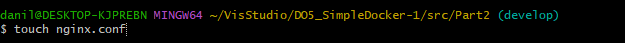
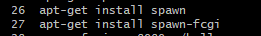

# DO5 Simple Docker

## Part 1. Готовый докер

**== Задание ==**

##### Возьми официальный докер-образ с **nginx** и выкачай его при помощи `docker pull`.
##### Проверь наличие докер-образа через `docker images`.
##### Запусти докер-образ через `docker run -d [image_id|repository]`.
##### Проверь, что образ запустился через `docker ps`.
##### Посмотри информацию о контейнере через `docker inspect [container_id|container_name]`.
##### По выводу команды определи и помести в отчёт размер контейнера, список замапленных портов и ip контейнера.
##### Останови докер контейнер через `docker stop [container_id|container_name]`.
##### Проверь, что контейнер остановился через `docker ps`.
##### Запусти докер с портами 80 и 443 в контейнере, замапленными на такие же порты на локальной машине, через команду *run*.
##### Проверь, что в браузере по адресу *localhost:80* доступна стартовая страница **nginx**.
##### Перезапусти докер контейнер через `docker restart [container_id|container_name]`.
##### Проверь любым способом, что контейнер запустился.

**== Выполнение ==**

Взял официальный докер-образ с **nginx** и выкачай его при помощи `docker pull`.

##### Проверил наличие докер-образа через `docker images`.

##### Запустил докер-образ через `docker run -d  nginx `.

##### Проверяю, что образ запустился через `docker ps`.

#####  Определяю размер контейнера, список замапленных портов и ip контейнера.

##### Остановил докер контейнер через `docker stop [container_id]`.

##### Проверяю, что контейнер остановился через `docker ps`.

##### Запустил докер с портами 80 и 443 в контейнере, замапленными на такие же порты на локальной машине, через команду *run*.

`##### Проверяю, что в браузере по адресу *localhost:80* доступна стартовая страница **nginx**.`

##### Перезапустил докер контейнер через `docker restart [container_id]`.

## Part 2. Операции с контейнером

**== Задание ==**

##### Прочитай конфигурационный файл *nginx.conf* внутри докер контейнера через команду *exec*.
##### Создай на локальной машине файл *nginx.conf*.
##### Настрой в нем по пути */status* отдачу страницы статуса сервера **nginx**.
##### Скопируй созданный файл *nginx.conf* внутрь докер-образа через команду `docker cp`.
##### Перезапусти **nginx** внутри докер-образа через команду *exec*.
##### Проверь, что по адресу *localhost:80/status* отдается страничка со статусом сервера **nginx**.
##### Экспортируй контейнер в файл *container.tar* через команду *export*.
##### Останови контейнер.
##### Удали образ через `docker rmi [image_id|repository]`, не удаляя перед этим контейнеры.
##### Удали остановленный контейнер.
##### Импортируй контейнер обратно через команду *import*.
##### Запусти импортированный контейнер.
##### Проверь, что по адресу *localhost:80/status* отдается страничка со статусом сервера **nginx**.

**== Выполнение ==**

##### Читаю конфигурационный файл *nginx.conf* внутри докер контейнера через команду *exec*, вначлае пишу winpty, так как мой терминал не поддерживает интерактивный режим TTY(В GitBash).

##### Создал на локальной машине файл *nginx.conf* в папке Part2.

##### Настроил в нем по пути */status* отдачу страницы статуса сервера **nginx**.

##### Скопировал созданный файл *nginx.conf* внутрь докер-образа через команду `docker cp`.

##### Перезапустил **nginx** внутри докер-образа через команду *exec*.

##### Проверяю, что по адресу *localhost:80/status* отдается страничка со статусом сервера **nginx**.

##### Экспортировал контейнер в файл *container.tar* через команду *export*.

##### Остановил контейнер.

##### Удалил образ через `docker rmi [image_id|repository]`, не удаляя перед этим контейнеры.

##### Импортирую контейнер обратно через команду *import*.

##### Запустил импортированный контейнер с флагом -f 'daemon off;'.

##### Проверяю, что по адресу *localhost:80/status* отдается страничка со статусом сервера **nginx**.

## Part 3. Мини веб-сервер

**== Задание ==**

##### Напиши мини-сервер на **C** и **FastCgi**, который будет возвращать простейшую страничку с надписью `Hello World!`.
##### Запусти написанный мини-сервер через *spawn-fcgi* на порту 8080.
##### Напиши свой *nginx.conf*, который будет проксировать все запросы с 81 порта на *127.0.0.1:8080*.
##### Проверь, что в браузере по *localhost:81* отдается написанная тобой страничка.
##### Положи файл *nginx.conf* по пути *./nginx/nginx.conf* (это понадобится позже).

**== Выполнение ==**

##### Перекидываю файл hello.c в контейнер и сам перехожу в него до этого обновив конфиг как в предыдущих заданиях

#### Обновляем пакеты и качаем gcc в контейнере

#### Компилируем наш hello.c

#### Качаем spawn 

#### Запускаем сервер на порту 80

#### Перезапускаем nginx

#### У нас выводится Hello World 

## Part 4. Свой докер

**== Задание ==**

#### Напиши свой докер-образ, который:
##### 1) собирает исходники мини сервера на FastCgi из [Части 3](#part-3-мини-веб-сервер);
##### 2) запускает его на 8080 порту;
##### 3) копирует внутрь образа написанный *./nginx/nginx.conf*;
##### 4) запускает **nginx**.
##### Собери написанный докер-образ через `docker build` при этом указав имя и тег.
##### Проверь через `docker images`, что все собралось корректно.
##### Запусти собранный докер-образ с маппингом 81 порта на 80 на локальной машине и маппингом папки *./nginx* внутрь контейнера по адресу, где лежат конфигурационные файлы **nginx**'а (см. [Часть 2](#part-2-операции-с-контейнером)).
##### Проверь, что по localhost:80 доступна страничка написанного мини сервера.
##### Допиши в *./nginx/nginx.conf* проксирование странички */status*, по которой надо отдавать статус сервера **nginx**.
##### Перезапусти докер-образ.
##### Проверь, что теперь по *localhost:80/status* отдается страничка со статусом **nginx**

**== Выполнение ==**

#### Написанный Dockerfile

#### Собираю через docker build

##### Проверяю через `docker images`, что все собралось корректно.

#### Запускаю собранный докер-образ с маппингом 81 порта на 80 на локальной машине.

##### Проверяю, что по localhost:80 доступна страничка написанного мини сервера.

##### Дописал в *./nginx/nginx.conf* проксирование странички */status*

`Перезапустил докер-образ.`

##### Проверяю, что теперь по *localhost:80/status* отдается страничка со статусом **nginx**

## Part 5. **Dockle**

**== Задание ==**

##### Просканируй образ из предыдущего задания через `dockle [image_id|repository]`.
##### Исправь образ так, чтобы при проверке через **dockle** не было ошибок и предупреждений.

**== Выполнение ==**

#### Перешел на личный Mac, так как на Винде нет dockle

#### Первые ошибки

#### Исправленный Dockerfile

#### Больше нет ошибок

## Part 6. Базовый **Docker Compose**

**== Задание ==**

##### Напиши файл *docker-compose.yml*, с помощью которого:
##### 1) Подними докер-контейнер из [Части 5](#part-5-инструмент-dockle) _(он должен работать в локальной сети, т.е. не нужно использовать инструкцию **EXPOSE** и мапить порты на локальную машину)_.
##### 2) Подними докер-контейнер с **nginx**, который будет проксировать все запросы с 8080 порта на 81 порт первого контейнера.
##### Замапь 8080 порт второго контейнера на 80 порт локальной машины.

##### Останови все запущенные контейнеры.
##### Собери и запусти проект с помощью команд `docker-compose build` и `docker-compose up`.
##### Проверь, что в браузере по *localhost:80* отдается написанная тобой страничка, как и ранее.

**== Выполнение ==**

##### Пишу свой YML файл 

##### Собрал и запустил проект с помощью команд `docker-compose build` и `docker-compose up -d`.

#####

##### Проверяю, что в браузере по *localhost:80* отдается написанная мной страничка, как и ранее.

